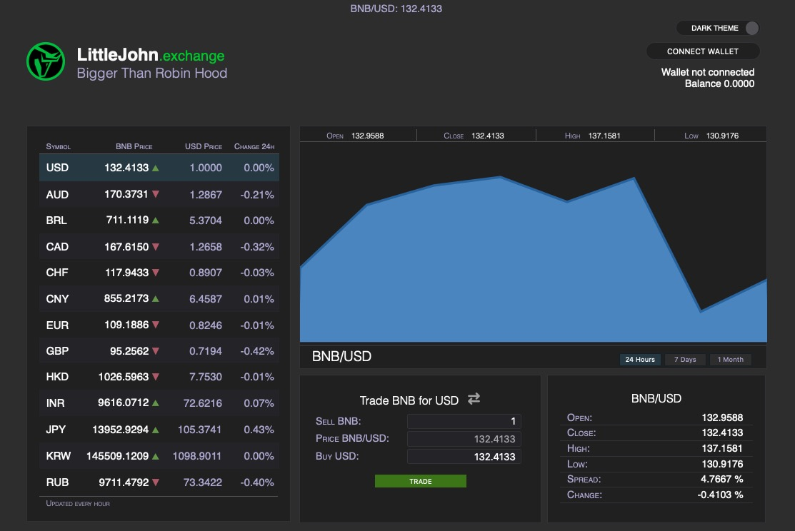
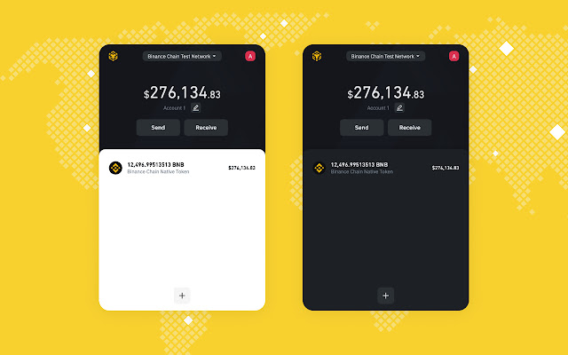
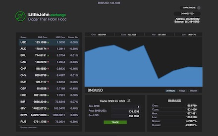

# LittleJohn Exchange

## Bigger than Robin Hood

Visit us at [https://littlejohn.exchange](https://littlejohn.exchange)



LittleJohn is a decentralized exchange built on Binance Smart Chain where you can trade the top fiat currencies in the world with just one click, no KYC, no market manipulation, no blocking trades, the way it should be.



In order to use LittleJohn you need to install [Binance Smart Chain Wallet](https://chrome.google.com/webstore/detail/binance-chain-wallet/fhbohimaelbohpjbbldcngcnapndodjp) extension for Brave, Chrome and Firefox, unfortunately Safari and Edge extensions are not ready yet. So go get the wallet at the [Chrome Store](https://chrome.google.com/webstore/detail/binance-chain-wallet/fhbohimaelbohpjbbldcngcnapndodjp) and install it in your browser of choice. If you don't have Binance Wallet you can use Metamask too!

Now you can use LittleJohn at its fullest and you'll quickly learn how easy it is to interact with the DApp since it has been designed to be a one-click trading experience. Just select the currency you'd like to buy or sell then enter the amount in the form, the price will reflect the current rate at which you'll trade your currency, then click 'TRADE'. Your Binance Wallet will pop up asking to confirm a transaction and you should click 'Approve' in order to perform a trade. That's it, you will get fiat tokens in your wallet as you can confirm in your new balance.

Once you get your currencies you can send them to any person or business that takes fiat currencies as these tokens are backed by every single BNB traded for them. If you decide to sell your currencies then do the opposite transaction, sell your fiat and get BNB at market price. We collect 1% fee on every transaction for site maintenance and hosting costs.

**That's how easy it is to trade currencies in LittleJohn!**


## Fiat Tokens

Fiat synthetic tokens are based on the BEP20 token specification, derived from ERC20 smart contracts they can be easily implemented in Binance Smart Chain Network and all Ethereum compatible networks.

In order to add fiat tokens to your Binance wallet, select the Assets panel and press the (+) button, then enter the token address as specified in this list and the wallet will autommatically fetch the token info. Once you click on the Add Asset button the token will appear on the list and the balance shown.

**Now you're ready to buy and sell fiat tokens on LittleJohn!**


## Contract Addresses on Testnet

AUD [0x65275d7d6Ba47E44f7163690cd7C91aE608177Dc](https://testnet.bscscan.com/address/0x65275d7d6Ba47E44f7163690cd7C91aE608177Dc)

BRL [0xA9AB46C8eE740b4A833e0FDC2d3875c5065F25fd](https://testnet.bscscan.com/address/0xA9AB46C8eE740b4A833e0FDC2d3875c5065F25fd)

CAD [0xD19527b8820e46D0B63F19A0D92A25C7FF1f7976](https://testnet.bscscan.com/address/0xD19527b8820e46D0B63F19A0D92A25C7FF1f7976)

CHF [0xb0D82b45efE94d122dc4DEE1E36ecC4EfF4072Ff](https://testnet.bscscan.com/address/0xb0D82b45efE94d122dc4DEE1E36ecC4EfF4072Ff)

CNY [0xE9867f79A87e33777B8C82A9fFaA8F1047B83247](https://testnet.bscscan.com/address/0xE9867f79A87e33777B8C82A9fFaA8F1047B83247)

EUR [0x2ddd8bF596cfefE84584926a40D49eEfb8cb6a74](https://testnet.bscscan.com/address/0x2ddd8bF596cfefE84584926a40D49eEfb8cb6a74)

GBP [0x7cDB80DDa34Aa315e45E38e07df719099ae4379F](https://testnet.bscscan.com/address/0x7cDB80DDa34Aa315e45E38e07df719099ae4379F)

HKD [0x4d9c163BffFd0F0091922603433010a0F363746C](https://testnet.bscscan.com/address/0x4d9c163BffFd0F0091922603433010a0F363746C)

INR [0x342CE2fB52Fb3962630E6226b9a94D1cEedF24E3](https://testnet.bscscan.com/address/0x342CE2fB52Fb3962630E6226b9a94D1cEedF24E3)

JPY [0xbFcbf3260e9198e0CFD153F1E353D4b9B1477c78](https://testnet.bscscan.com/address/0xbFcbf3260e9198e0CFD153F1E353D4b9B1477c78)

KRW [0xE4AE08CbCed660C1a2a6522187aaEd22131CFcf8](https://testnet.bscscan.com/address/0xE4AE08CbCed660C1a2a6522187aaEd22131CFcf8)

RUB [0x0B416A47bC4d5718CF9925Fc3712e9e98940246a](https://testnet.bscscan.com/address/0x0B416A47bC4d5718CF9925Fc3712e9e98940246a)

USD [0x20f0ed2cCFa648C0c784f0A00E2408A7c3393fc2](https://testnet.bscscan.com/address/0x20f0ed2cCFa648C0c784f0A00E2408A7c3393fc2)


## How to run

Here are the steps if you want to run the app locally:

```
$ git clone https://github.com/kuyawa/littlejohn
$ cd littlejohn/src
$ npm install
$ node index
```

That's it!


## LittleJohn Video

[](https://www.youtube.com/watch?v=X7UDRCKiQ5s)

https://www.youtube.com/watch?v=X7UDRCKiQ5s

Visit us at https://littlejohn.exchange
